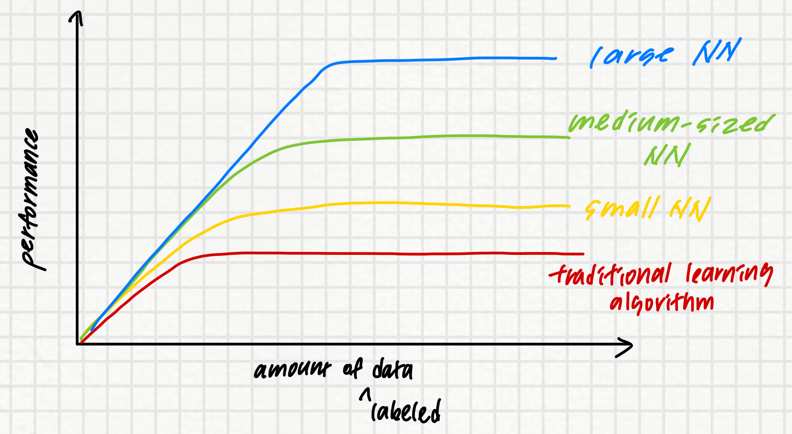

# Introduction to Deep Learning

## Neural Network


+ Stack single neurons &rarr; Larger neural network


+ Each of hidden units takes its inputs all input features

__To manage neural network__

1. Give the input x and output y for a number of examples in the training set.
2. Then it will figure out the hidden layers part by itself.


## Supervised Learning

: input x and output y are cleverly selected and given

+ Structured Data : database
+ Unstructured Data : audio, image, text, ...
  + computers are now much better at interpreting unstructured data (thanks to neural networks and deep learning)

## Why is Deep Learning taking off?



For high level performance, you need

1) to be able to train a __big enough neural network__
2) a lot of __data__

&rarr; the scales driving the deep learning progress

+ `data`
+ `computation`
    1. implement the idea 
    2. code
    3. run experiment
    4. repeat in cycle
+ `algorithms` : making NN run much faster
  + ex. Sigmoid function &rarr; ReLU function
      
    + gradient nearly 0, learning becomes slow
        


## __Logistic Regression__ as a Neural Network

### Logistic Regression for `Binary Classification`

+ Give an image represented as X as the input and train the classifier &rarr; Predict if the output label y is rather 0 or 1
+ Given X, want ŷ to be P(y=1|x)

__ŷ = σ(ω<sup>T</sup>x+b), where σ(z) = 1/1+e<sup>-z</sup> (Z = ω<sup>T</sup>x+b)__

```
x, ω : dimensional vector
b : real number
```

+ ŷ<sup>(i)</sup> = σ(ω<sup>T</sup>x<sup>(i)</sup>+b), where σ(Z<sup>(i)</sup>) = 1/1+e<sup>-z<sup>(i)</sup></sup> (Z<sup>(i)</sup> = ω<sup>T</sup>x<sup>(i)</sup>+b)

  + Given { (x<sup>(1)</sup>, y<sup>(1)</sup>), (x<sup>(2)</sup>, y<sup>(2)</sup>), ... , (x<sup>(i)</sup>, y<sup>(i)</sup>) }
  + want ŷ<sup>(i)</sup> ≈ y<sup>(i)</sup>

### __Loss(error) function__

𝐿(ŷ, y) = 1/2(ŷ - y)<sup>2</sup> &rarr; (x), optimization problem

In Logistic Regression &rarr; __𝑳(ŷ, y) = -(ylogŷ + (1-y)log(1-ŷ))__

+ If y = 1, 𝐿(ŷ, y) = -logŷ
  + want logŷ to be large
  + want ŷ to be large

+ If y = 0, 𝐿(ŷ, y) = -log(1-ŷ)
  + want log(1-ŷ) to be large
  + want ŷ to be small

### __Cost function__

+ Measures how you're doing on the entire training set

